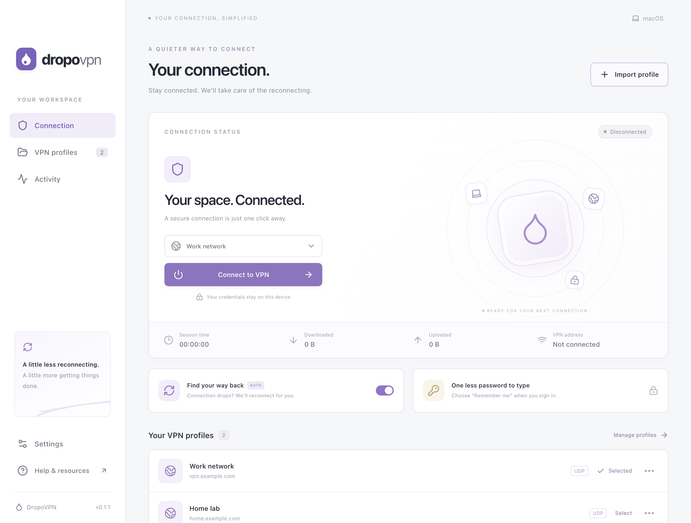
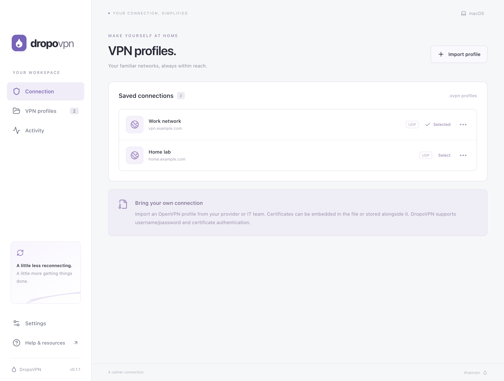
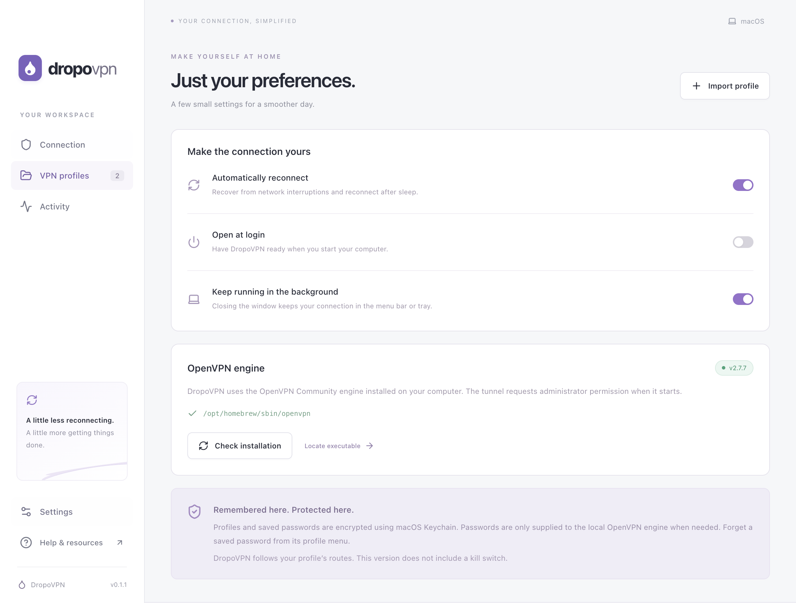

# DropoVPN

An Electron OpenVPN client for macOS and Windows, with automatic reconnection and an encrypted, per-profile saved password. The desktop interface uses React and TypeScript; the main process manages OpenVPN and credential storage.

**[Download the public preview](https://github.com/samnimoh/dropovpn/releases/tag/v0.1.1)** · [Report an issue](https://github.com/samnimoh/dropovpn/issues) · [MIT license](LICENSE)



## Downloads

| Platform | Installer | Architecture |
| --- | --- | --- |
| macOS | [DMG](https://github.com/samnimoh/dropovpn/releases/download/v0.1.1/DropoVPN-0.1.1-mac-arm64.dmg) · [ZIP](https://github.com/samnimoh/dropovpn/releases/download/v0.1.1/DropoVPN-0.1.1-mac-arm64.zip) | Apple Silicon / ARM64 |
| Windows | [Installer](https://github.com/samnimoh/dropovpn/releases/download/v0.1.1/DropoVPN-0.1.1-win-x64.exe) | Intel / AMD x64 |

[Release notes](https://github.com/samnimoh/dropovpn/releases/tag/v0.1.1) · [SHA-256 checksums](https://github.com/samnimoh/dropovpn/releases/download/v0.1.1/SHA256SUMS.txt)

**Version 0.1.1 is an unsigned public preview.** macOS notarization is not included; your operating system may display security warnings. The macOS app has been launched and tested locally. The Windows installer was cross-built; Windows runtime/elevation and live VPN routing still require testing. There is no Intel Mac installer in this release.

DropoVPN is a client, not a VPN service. Install OpenVPN Community 2.6+ separately and bring a working `.ovpn` profile. OpenVPN Connect does not provide the executable this application uses. There is no kill switch; traffic is not blocked during reconnection.

## Screenshots

Screenshots show the actual desktop app with synthetic example profiles. No real server, certificate, password, or active VPN connection is included.

<details>
<summary>VPN profiles</summary>



</details>

<details>
<summary>Preferences and engine setup</summary>



</details>

## Run locally

Use Node.js 24 or newer.

```sh
npm ci
npm start
```

For development with hot reload:

```sh
npm run dev
```

Install **OpenVPN Community 2.6 or newer** separately. OpenVPN Connect is a different product and does not provide the executable used here.

- **macOS:** `brew install openvpn`. DropoVPN checks the standard Apple Silicon and Intel Homebrew locations. You can also select an executable in Settings.
- **Windows:** install [OpenVPN Community](https://openvpn.net/community-downloads/) including its network driver. The default path is `C:\Program Files\OpenVPN\bin\openvpn.exe`.

Open **Import profile**, choose your `.ovpn` file, select the profile, and connect. Enter your VPN username/password and leave **Remember me on this device** checked to reuse them after reconnecting or restarting the app. Approve the operating system's administrator prompt to create the tunnel. The VPN password and your computer's administrator password are separate.

You can also open a profile with DropoVPN from Finder/Explorer or pass the `.ovpn` path to the application. Importing a file never connects automatically.

Older exports using `ignore-unknown-option block-outside-dns` are accepted. The Windows DNS option is retained on Windows and omitted on macOS. Profiles specifying only an AES-CBC `cipher` are migrated to an explicit data-cipher list (modern ciphers first) and matching legacy fallback for OpenVPN 2.6+. Existing `data-ciphers` policies and explicit fallbacks are respected.

Closing the window keeps the application in the menu bar/system tray by default. **Quit DropoVPN** disconnects the tunnel. Change this behavior in Settings.

## Behavior

- Imports multiple profiles, including embedded certificates and adjacent certificate files. Profiles can be renamed or removed.
- Encrypts profile material and optional saved credentials with Electron `safeStorage`: macOS Keychain-backed encryption or Windows DPAPI. There is no plaintext storage fallback. Windows DPAPI protects against other users, not all applications running as the same user.
- Keeps unsaved credentials in the main process only for the current connection session. Private-key passphrases are session-only.
- Uses OpenVPN's management channel to supply credentials on initial authentication, renegotiation and network reconnection.
- Configures keepalive, unlimited connection attempts and exponential retry delays capped at 30 seconds. Resuming the computer requests a fresh connection. Unexpected engine termination after a successful connection can restart the engine with backoff; administrator permission may be requested again. Fatal configuration failures or declined elevation require manual retry.
- Pauses on rejected credentials so a bad password is not repeatedly submitted. A manual disconnect or quit cancels reconnection.
- Shows tunnel status, session duration, VPN address, byte counters and a bounded in-memory activity log. Counters are OpenVPN's engine counters, not billing or application traffic totals.
- Adds and removes a per-tunnel macOS DNS resolver for pushed `dhcp-option DNS` servers. Windows networking/DNS configuration is handled by OpenVPN and its installed driver.

## Security boundaries

The Electron renderer is sandboxed, with context isolation, no Node.js integration, a restrictive Content Security Policy, no remote content, denied permissions, and a narrow validated IPC API. It never receives a saved password or a decrypted profile. Browser previews cannot connect to VPNs.

Only the OpenVPN process is elevated. macOS uses the system authorization dialog; Windows uses UAC. Imported profiles use a directive allowlist, reject scripts/plugins/includes, constrain external certificates to the profile folder, and require server verification. The launcher copies validated profile bytes and the trusted DNS helper into a private administrator-owned runtime directory and verifies SHA-256 hashes before execution. Only the application-owned DNS helper is executable.

The management socket binds to loopback on an ephemeral port and uses a random management password. An independent configuration secret proves the engine's identity before VPN credentials are sent. The engine connects to the application using `management-client`, so loss of the control connection causes OpenVPN to exit. VPN passwords are sent through this socket, never through process arguments or auth files. All secrets are excluded from snapshots and authentication log messages are suppressed.

The engine necessarily uses temporary decrypted certificate material in its protected runtime directory. User-owned staging files are removed once the engine proves its identity, and the elevated launcher removes its runtime directory when OpenVPN exits. A hard system crash can leave temporary files that need cleanup.

There is **no kill switch**. Traffic follows the profile's routes; split-tunnel profiles do not protect every destination. During reconnection, do not assume traffic is blocked. Servers that require OTP, browser SSO, proxy authentication or hardware-token interaction are not supported by this version. TAP profiles and `<connection>` blocks are not currently supported. Modern `dns` directives/split DNS and platform-specific profile options may need a compatible exported profile.

## Checks and installers

```sh
npm run check          # TypeScript, production UI build, unit/integration tests
npm run test:electron  # Real Electron window, IPC, navigation, settings, screenshots
node scripts/check-profile.mjs /path/to/profile.ovpn # Private profile validation against loopback only
npm run dist:mac       # DMG and ZIP on macOS
npm run dist:win       # NSIS installer on Windows
```

The test suite includes a real OpenVPN management handshake when the executable is installed. That test uses `dev null` and loopback, with no elevation, tunnel, route changes or external VPN server. It skips if the engine is unavailable. The protocol tests cover credential replay, rejection, engine crashes, explicit disconnect, wake from sleep, and peer impersonation. Store tests exercise encryption through an injected cipher; the desktop application uses the operating system's provider.

GitHub Actions builds on native macOS and Windows runners and uploads installers. OpenVPN and its driver are not bundled. Installers are unsigned until release signing credentials are supplied. For distribution, configure Electron Builder's macOS Developer ID/notarization and Windows signing; consistent macOS signing also avoids unnecessary Keychain prompts across updates. The development toolchain currently has transitive moderate `sprintf-js` advisories through Electron Builder; `npm audit --omit=dev` reports no production dependency advisories at the time of implementation.

A real VPN profile/server is required to validate end-to-end routing, DNS and reconnect behavior for your environment. Windows elevation and driver behavior must also be verified on a Windows machine; a macOS build does not validate them.

## Implementation references

- [OpenVPN management interface](https://openvpn.net/community-docs/management-interface.html)
- [OpenVPN 2.7 manual](https://openvpn.net/community-docs/community-articles/openvpn-2-7-manual.html)
- [Electron safeStorage](https://www.electronjs.org/docs/latest/api/safe-storage)

Application source is MIT licensed. OpenVPN is distributed separately under its own license.

## Download website

The static website lives in `website/` and is deployed to Vercel. Installer files are served from the versioned GitHub Release, keeping large binaries out of Git and website deployments.

```sh
python3 -m http.server 4178 --directory website
# Publish using the configured Vercel account:
vercel --prod --yes --cwd website
```

To refresh the public screenshots, run `npm run build && node scripts/screenshots.mjs`. The script launches an isolated desktop session with synthetic profiles and never starts a VPN connection.

For a new release, build and validate the installers, publish them together with SHA-256 checksums on GitHub, then update the versioned links in `website/index.html` and this README before redeploying. No automatic updater is included.
